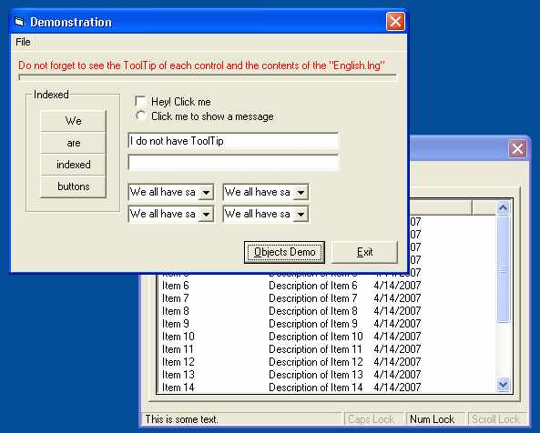



## clsTranslator

### Description

clsTranslator is a class that will allow you to easily, very easily indeed, add Multilingual UI feature to your apps. It fulfils all the things that are helpful in implimenting this feature. Using it is easy too: the syntax of the language files it adopts is very simple, only two lines of code are required to use it and you do not have to make any changes to your app in order to use it (like inserting tags to each control). Being feature-ful and easy, it is fast too. I first developed it for my "CoolWeb" but when it became a feature-ful class, I thought that it should be a separate submission.
 
### More Info
 

             |
---                |---
**Submitted On**   |2007-04-13 16:20:02
**By**             |[Agam Saran](https://github.com/Planet-Source-Code/PSCIndex/blob/master/ByAuthor/agam-saran.md)
**Level**          |Intermediate
**User Rating**    |5.0 (10 globes from 2 users)
**Compatibility**  |VB 5\.0, VB 6\.0
**Category**       |[Miscellaneous](https://github.com/Planet-Source-Code/PSCIndex/blob/master/ByCategory/miscellaneous__1-1.md)
**World**          |[Visual Basic](https://github.com/Planet-Source-Code/PSCIndex/blob/master/ByWorld/visual-basic.md)
**Archive File**   |[clsTransla2060054132007\.zip](https://github.com/Planet-Source-Code/agam-saran-clstranslator__1-68347/archive/master.zip)

